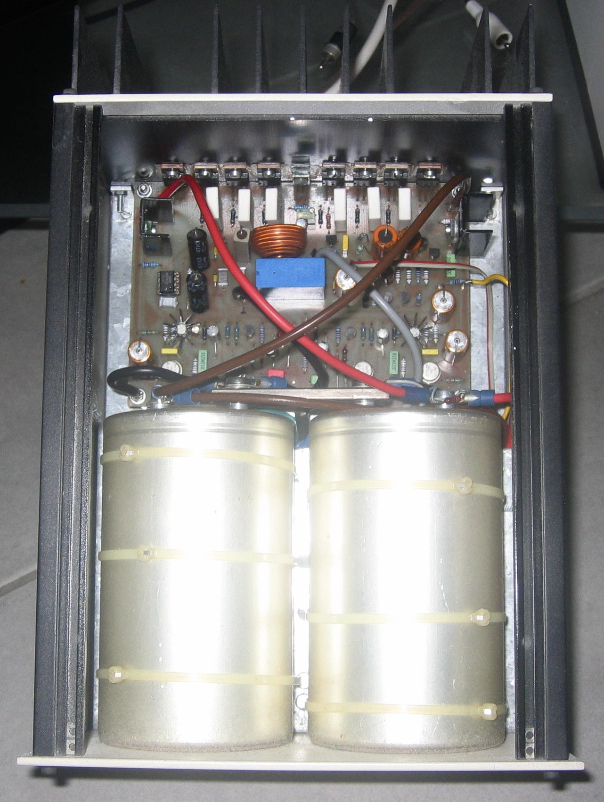
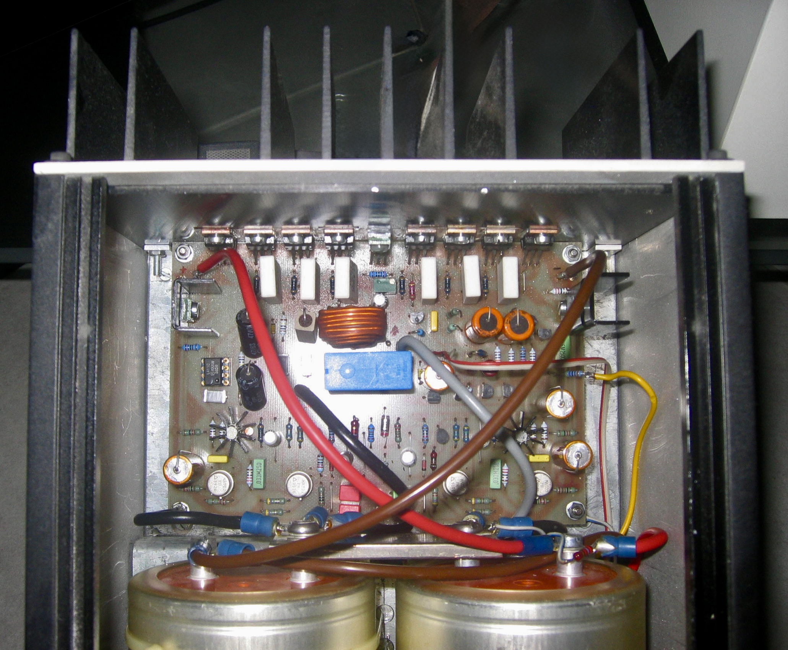
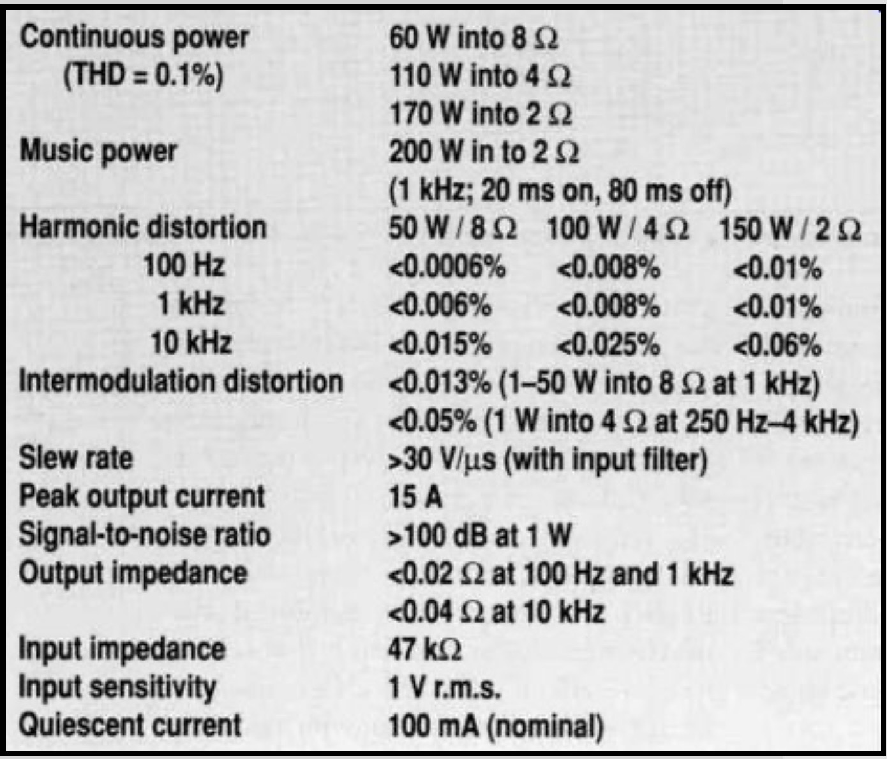
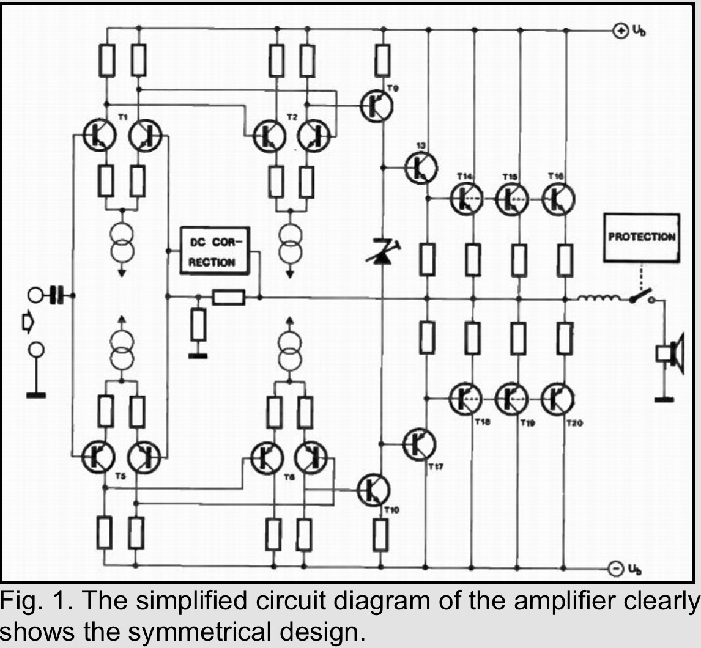
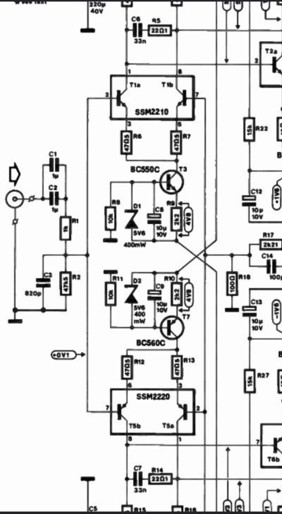
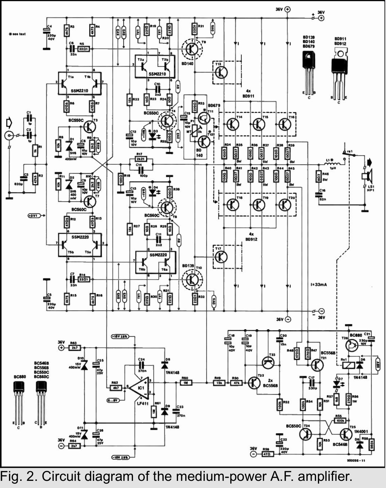
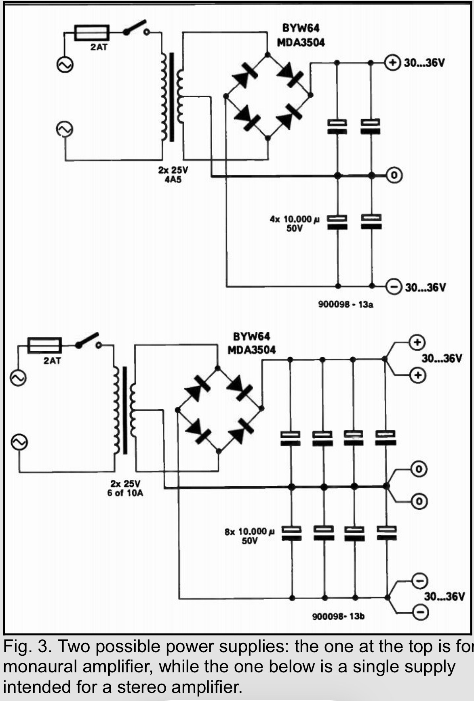

# RTAL Reference Power Amplifier
## Engineering Heritage Archive

> *A handcrafted reference power amplifier based on the renowned Elektor "Medium Power Amplifier" design.*

   
3. Handcrafted amplifier PCB

   

# Engineering Contributions

## PCB
The PCB was etched, drilled, populated and tested entirely by hand.

## Mechanical Design
The complete aluminium chassis, front panel and rear panel were designed and built specifically for this project.

## Power Supply
The original supply concept was further optimized and integrated into the RTAL Reference system.

## Remote Power Control
The amplifier powers on automatically when the RTAL Reference One preamplifier is switched on and shuts down automatically together with it.

# Listening Character

The amplifier delivers a neutral, transparent and effortless presentation with excellent loudspeaker control and was specifically matched to the RTAL CHAD-003 loudspeakers.

# Original Elektor Design

This project is based on the celebrated Medium Power Amplifier published by Elektor Electronics.

Original publication:
- 10/1990
- 11/1990
- 12/1990
- 01/1991
- 06/1991

- Figure 1 Technical Data

    
- Figure 2 Simplified Circuit

    
- Figure 3 Symmetrical Design

   
- Figure 4 Complete Circuit

   
- Figure 5 Power Supply

Source acknowledgement:
T. Giffard, Medium Power Amplifier, Elektor Electronics (1990–1991).

# Engineering Heritage

This repository forms part of the Realtime Audio Lab Engineering Heritage Archive and documents both the original Elektor inspiration and the RTAL engineering enhancements.

© Realtime Audio Lab
